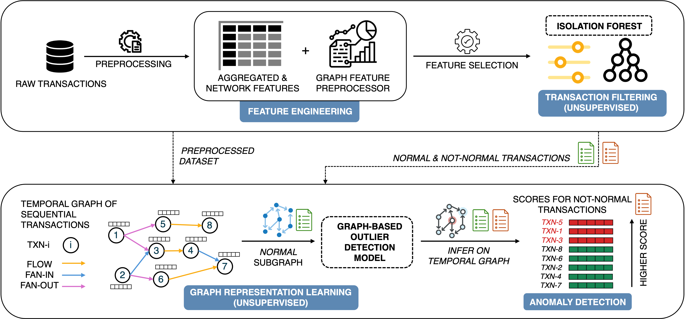

# Self-Supervised Learning with Graphical Context to Effectively Capture Complex Money Laundering Activities
### Framework


## **Instructions to run the code**

The code is compatible with **Python 3.11**. It can be downloaded and installed from [python.org](https://www.python.org/downloads/). Follow these steps to set up and run the notebooks:


1. **Clone (or download) the repository and navigate to the folder:**
    ```bash
    git clone https://github.com/alenkaja00/aml_transaction_ad.git
    ```
    ```bash
    cd aml_transaction_ad
    ```


2. **Create a virtual environment (optional)**

    - **Using `venv`:**
    ```bash
    python3 -m venv name_of_my_env
    ```
    - **Using `virtualenv`:**
    ```bash
    virtualenv name_of_my_env
    ```
    - **Using `conda`:**
    ```bash
    conda create --name name_of_my_env python=3.11
    ```


3. **Activate the virtual environment:**

    - On **Windows**:
    ```bash
    name_of_my_env\Scripts\activate
    ```

    - On **macOS/Linux**:
    ```bash
    source name_of_my_env/bin/activate
    ```


4. **Install requirements**
    ```bash
    pip install -r requirements.txt
    ```
Additionally, ensure that a Java Development Kit (JDK) compatible with PySpark (such as **OpenJDK 11**) is properly installed and linked in your system. Verify the installation by running `java -version` from your terminal.